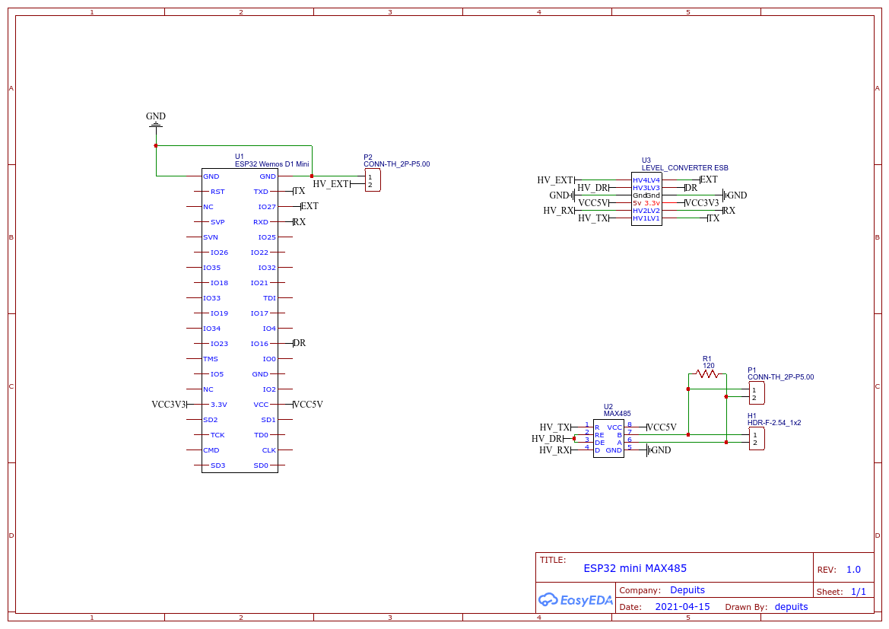

# Esphome SDM enery meter custom component

This is a fully-working example of reading data from SDM enetry meter using device with Esphome firmware.

In this implementation I am using HardwareSerial to read data from SDM, because it's more stable than SoftwareSerial.

You should use TTL to RS485 converter and connect RX port of converter to TX port of Esphome device and TX port of converter to RX port of Esphome device.

This component uses the SDM library from https://github.com/reaper7/SDM_Energy_Meter

## TODO

Not all registers are implemented as sensor yet. Only folowing are currently supported:

- sdm_phase_1_voltage
- sdm_phase_1_current
- sdm_phase_1_power
- sdm_import_active_energy

You can find all registers in SDM.h file.

## Example

### Configuration

``` YAML
# load the component
external_components:
  - source: github://depuits/esphome-SDM-enery-meter

# disable logging
logger:
  baud_rate: 0

# uart setup
uart:
  tx_pin: TX
  rx_pin: RX
  baud_rate: 9600
  stop_bits: 1

# sdm sensor component setup
sensor:
- platform: sdm

  # optional parameters with defaults
  baud_rate: 9600
  tx_pin: TX
  rx_pin: RX
  channel: 1
  dere_pin: 16 # -1 is disabled

  # sdm registers to read and report
  sdm_phase_1_voltage:
    name: "Voltage"
  sdm_phase_1_current:
    name: "Current"
  sdm_phase_1_power:
    name: "Power"
  sdm_import_active_energy:
    name: "Energy import"
```

### Schematic


